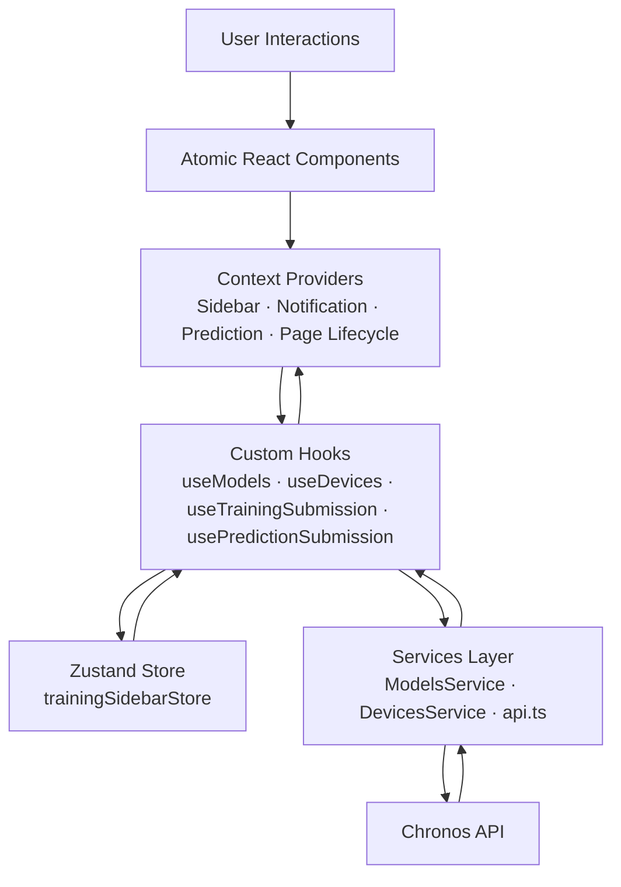
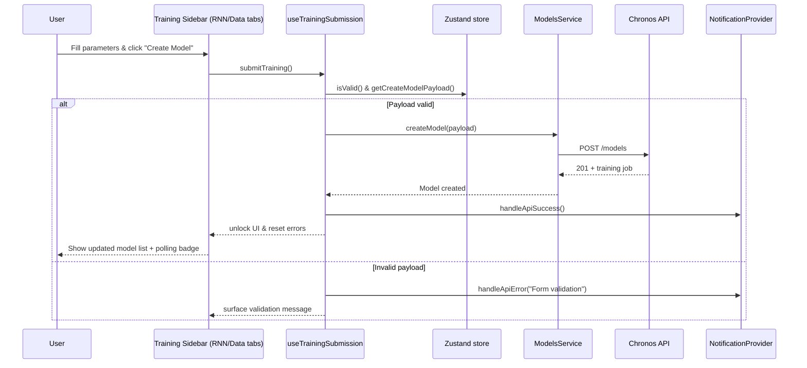
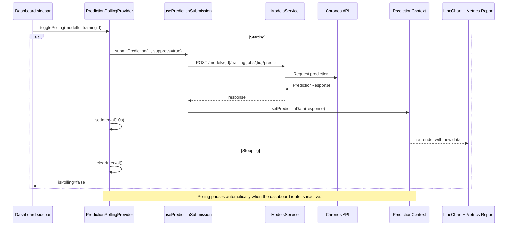

# Chronos Front-End

> A React + TypeScript control plane for orchestrating Chronos RNN trainings, live predictions, and in-app documentation for smart city time-series data.

   

## Table of Contents

- [Overview](#overview)
- [Feature Highlights](#feature-highlights)
- [Architecture Overview](#architecture-overview)
- [Core Workflows](#core-workflows)
- [Project Structure](#project-structure)
- [Setup & Tooling](#setup--tooling)
- [Quality Gates](#quality-gates)
- [UX & Engineering Guidelines](#ux--engineering-guidelines)
- [Extending the Platform](#extending-the-platform)
- [Resources](#resources)

## Overview

Chronos Front-End is the command center for configuring, training, and monitoring recurrent neural networks that forecast FIWARE-powered IoT streams. The application wraps complex model lifecycle operations in an opinionated UI that combines atomic-design components, live polling, and knowledge-base guidance.

- **Goal:** empower analysts and engineers to build, monitor, and iterate on time-series forecasting models with minimal friction.
- **Scope:** training orchestration, prediction visualization, operational documentation, and device/model catalog management.
- **Tech Stack:** React 19, TypeScript, Vite 7, Tailwind CSS 4, Zustand, Recharts, React Router 7, Vitest, Testing Library, ESLint/Prettier, Husky.

## Feature Highlights

- **Training Operations**
  - Wizard-like sidebar organized in atomic tabs (`Basic`, `Data`, `RNN`) with validation gates before submission.
  - Model cloning pipeline (`copyModelParams`) to reuse tuned hyperparameters across experiments.
  - Training job management (create/delete) with modal confirmations and toast-driven feedback.
  - Device, entity, and attribute selectors powered by FIWARE metadata with on-demand caching.

- **Prediction Analytics**
  - Interactive Recharts line graph highlighting real vs. forecasted values with automatic scaling and delta insights.
  - Adaptive polling engine (10 s intervals) that suspends when the user leaves the dashboard and resumes when they return.
  - Training metrics report summarizing MAE/MSE/RMSE/Theil U, execution time, and data volume.
  - Local persistence (LocalStorage) of selected model/training combos for rapid iteration.

- **Documentation & Enablement**
  - Embedded knowledge base backed by `src/data/documentation.json`, parsed at runtime with a custom Markdown-lite renderer.
  - Sidebar navigation, searchable sections, and contextual copy tailored to both technical and non-technical personas.

- **State & Reliability**
  - Context providers for notifications, predictions, polling, sidebar, and page lifecycle isolate shared concerns.
  - `useModels` hook centralizes caching, optimistic updates, and background refresh across all consumers.
  - Error normalization (`useApiErrorHandler`) translates HTTP failures into human-readable toasts.
  - Graceful teardown of timers and listeners prevents memory leaks during navigation.

- **Design System & UX**
  - Atomic design hierarchy (atoms → molecules → organisms → templates → pages) for scalable composition.
  - Tailwind CSS 4 theme tokens (`@theme`) defining Chronos branding colors and typography.
  - Accessible patterns (keyboard navigation in selectable cards, aria labels on icon buttons, focus-safe charts).

## Architecture Overview

The front-end is intentionally layered to keep UI, state, and side-effects loosely coupled.



**Key design choices**

- **Atomic component library**: `src/components` is divided into atoms (inputs, buttons, toasts), molecules (cards, sidebar content), organisms (complex composites), templates (layouts), and pages.
- **Context providers**: composed in `src/main.tsx` to guarantee child components can access notifications, prediction state, polling controls, and page lifecycle data.
- **Shared polling state**: hooks like `useTrainingPolling` and `PredictionPollingProvider` maintain singleton timers to avoid duplicate API calls when multiple components mount.
- **Domain adapters**: `ModelsAdapter` bridges the API schema (`ApiModel`, `ApiTraining`) to UI-friendly models, encapsulating normalization logic.
- **Config & environment**: `env.ts` safeguards against missing `VITE_API_BASE_URL` at runtime.

## Core Workflows

### Training job creation



### Live prediction polling



## Project Structure

```text
src/
  components/           # Atomic design implementation (atoms → pages)
  config/env.ts         # Runtime environment loader
  contexts/             # React context providers (Notification, Prediction, etc.)
  data/documentation.json
  hooks/                # Domain-specific logic (polling, sidebar, devices)
  mocks/, examples/     # Showcase datasets and UI examples
  services/             # API gateway wrappers (fetch-based)
  store/                # Zustand store managing training form state & caches
  styles/globals.css    # Tailwind 4 theme tokens & global styles
  test/                 # Vitest/Test Library setup utilities
  types/                # Shared domain and API contracts
  utils/                # Formatters, adapters, documentation parser
public/
  favicon.svg           # Static assets served by Vite
```

## Setup & Tooling

### Prerequisites

- Node.js **20+**
- npm (bundled with Node). Yarn/pnpm may work but are not officially supported in this repository.

### Environment variables

```bash
cp .env.example .env
# adjust to point at your Chronos API gateway
VITE_API_BASE_URL=http://localhost:8000
```

### Local development

```bash
npm install
npm run dev
```

Vite boots the app on `http://localhost:5173` by default. Hot Module Replacement (HMR) is enabled for rapid iteration.

### Production build

```bash
npm run build         # type-check + Vite build output in dist/
npm run preview       # serve the production bundle locally
```

## Quality Gates

- `npm run lint` — ESLint (TypeScript-aware) aligned with `typescript-eslint`, React hooks linting, and Prettier for formatting guarantees.
- `npm run format` / `npm run format:check` — Prettier applied to TSX/TS, JSON, CSS, and Markdown.
- `npm run test` — Vitest in watchless mode using jsdom + React Testing Library (`src/test/setup.ts`) for DOM assertions.
- Husky + lint-staged — auto-run on `git commit` to ensure staged files respect lint/format rules.

## UX & Engineering Guidelines

- Keep domain types in `src/types` authoritative; update adapters and services alongside backend schema changes.
- Favor custom hooks for side-effects and API orchestration to keep components declarative.
- Respect caching helpers (`shouldFetchDevices`, `sharedFetchModels`, `lastFetchTime`) to avoid storming the backend.
- Maintain atomic design boundaries: atoms remain dumb UI primitives, molecules/organisms handle composition and domain-specific rendering, templates wrap layout concerns.
- When extending polling or timers, always clear intervals on unmount and guard against duplicate timers (follow `useTrainingPolling` patterns).
- Persist lightweight UI state via `localStorage` when it improves UX (e.g., sidebar selections), but guard against SSR by checking `typeof window`.
- Write Vitest specs close to the components they cover (see `*.test.tsx` collocated) and reuse helpers in `src/test/test-utils.tsx`.

## Extending the Platform

1. **New API endpoints**
   - Add a method in `src/services/models.ts` (or create a new service file).
   - Expose type contracts in `src/types`.
   - Adapt the API shape inside a utility/adapter before reaching the UI.

2. **Additional sidebar modules**
   - Create a molecule for the form fragment.
   - Register it via `useSidebar().addItem` within the relevant page component.
   - Persist IDs using the provided storage keys when necessary.

3. **Custom metrics or charts**
   - Extend `PredictionResponse` and `convertPredictionToTrainingMetrics`.
   - Augment `TrainingMetricsReport` or compose a new organism alongside `LineChart`.

4. **Internationalization**
   - Centralize literal strings via a helper or translation table.
   - Leverage context providers to inject locale-specific formatters (date/number utilities already live in `src/utils`).

## Resources

- `/treinamentos` — Training hub with polling indicator and model CRUD.
- `/painel` — Dashboard with prediction charting, metrics, and live updates.
- `/documentacao` — Embedded guide parsed from `data/documentation.json`.
- `src/examples` — Reference dashboards and charts for experimentation.
- `src/mocks` — Seed data for prototyping offline flows.

---

For roadmap ideas, bug reports, or feature proposals, open an issue/PR and follow the guidelines above. Happy forecasting! 🎯
